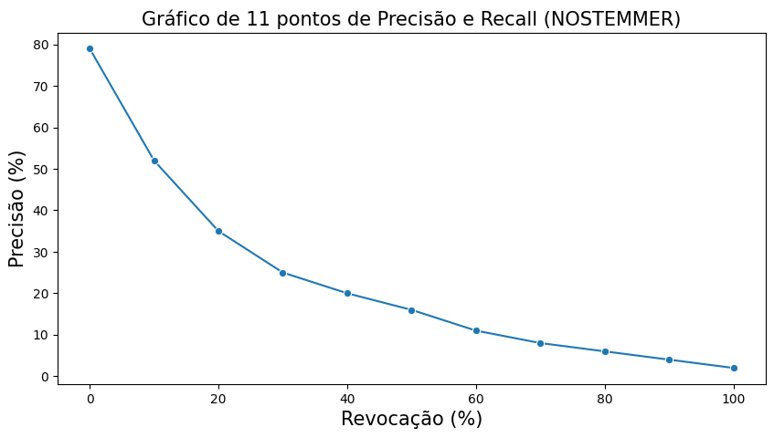
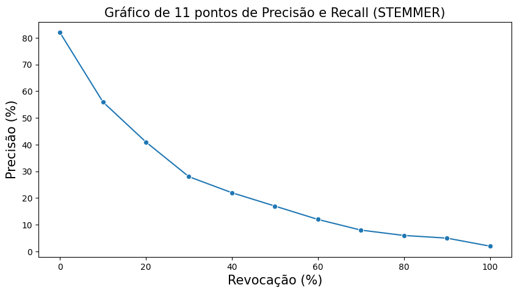
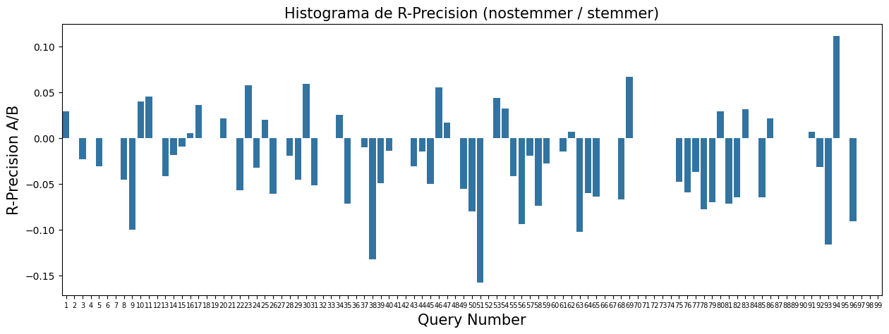

## Gráficos de 11 pontos de Precision e Recall

## F1

Média do f1@10 entre as consultas

- Média f1@10 nostemmer: 0.18
- Média f1@10 stemmer: 0.19

Média do f1@k, para todos os ks, entre as consultas

- Média f1@k nostemmer: 0.11
- Média f1@k nostemmer: 0.11

## Precision@5 e Precision@10

Média do Precision@k entre as consultas

- Média Precision@5 (nostemmer): 0.47
- Média Precision@5 (stemmer): 0.51
- Média Precision@10 (nostemmer): 0.39
- Média Precision@10 (stemmer): 0.42

## Histograma de R-Precision (nostemmer/stemmer)

## MAP

- MAP nostemmer: 0.21
- MAP stemmer: 0.23

## MRR

- MRR nostemmer: 0.77
- MRR stemmer: 0.78

## DCG

- DCG nostemmer: 28.74
- DCG stemmer: 30.27

## NDCG

- NDCG nostemmer: 0.54
- NDCG stemmer: 0.57
